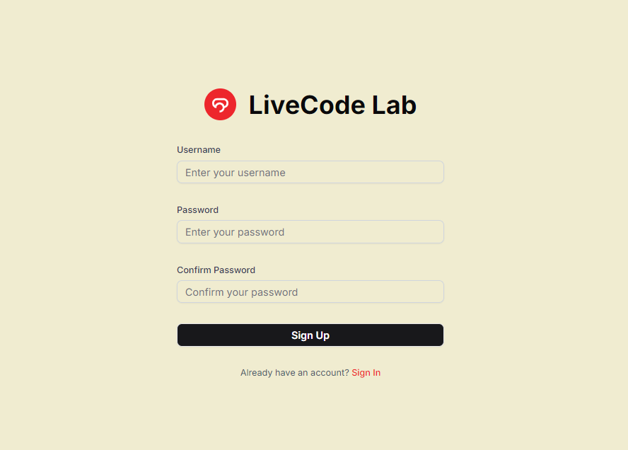
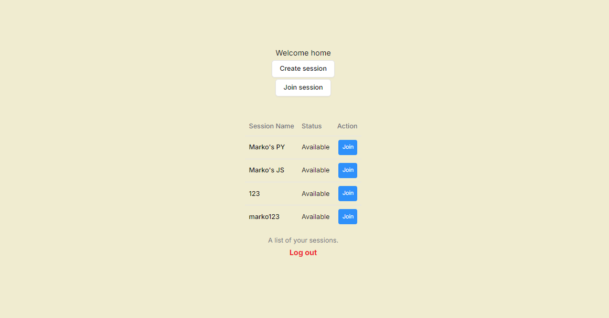
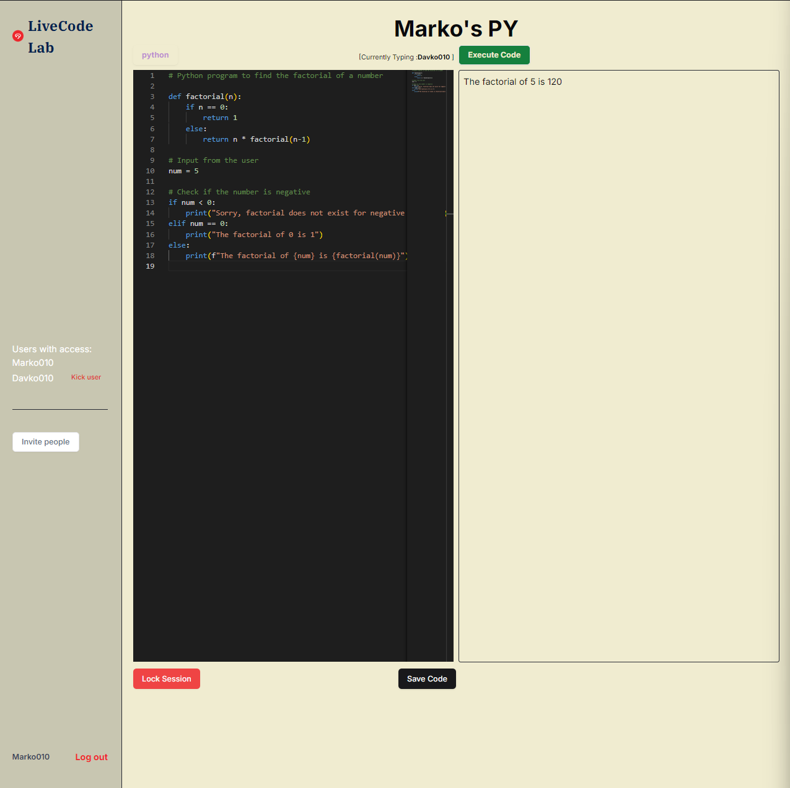

# LiveCode_Lab

- Real-Time Collaborative Code Playground

## Table of Contents

- [LiveCode_Lab](#livecode_lab)
  - [Table of Contents](#table-of-contents)
  - [Features](#features)
  - [Tech Stack](#tech-stack)
  - [Prerequisites](#prerequisites)
  - [WebSocket Events](#websocket-events)
  - [Application UI](#application-ui)
  - [Disclaimer](#disclaimer)
    - [Server `.env` Configuration](#server-env-configuration)
    - [Client `.env` Configuration](#client-env-configuration)

## Features

- **Real-Time Collaboration**: Multiple users can edit code simultaneously.
- **Session Management**: Create, join, and manage coding sessions with unique tokens.
- **User Authentication**: Secure login and registration for users.
- **Code Execution**: Execute code and view results in real-time.

## Tech Stack

- **Frontend**: NextJs, TypeScript
- **Backend**: Node.js, TypeScript, Express
- **Database**: PostgreSQL
- **WebSocket**: Socket.IO for real-time communication
- **ORM**: TypeORM for database interactions

## Prerequisites

- Node.js
- PostgreSQL

## WebSocket Events

- The application supports the following WebSocket events:

- **USER_JOIN_EVENT**: Triggered when a new user joins the session.
- **CODE_CHANGE_EVENT**: Triggered when the code is changed in the editor (listening on keyboard input).
- **CODE_SUBMIT_EVENT**: Triggered when code is the save code button is clicked.
- **EXECUTE_CODE_EVENT**:Triggered when code is submitted for execution.
- **KICK_USER_EVENT**: Triggered to kick a user from the session.
- **LOCK_SESSION_EVENT**: Triggered to lock or unlock the session

## Application UI







## Disclaimer

Before running the project, it is crucial to set up the environment variables properly. Both the server and client applications require their own `.env` files. Follow the instructions below to ensure that development environment is correctly configured.

### Server `.env` Configuration

```env
PORT=5000
DB_HOST=localhost
DB_PORT=5432
DB_USER=postgres
DB_PASSWORD=postgres
DB_NAME=LiveCode_Lab
JWT_SECRET=unique_jwt_secret_key
```

- PORT: The port the server will run on (default: 5000).
- DB_HOST: The hostname of PostgreSQL database.
- DB_PORT: The port PostgreSQL is running on .
- DB_USER: PostgreSQL username.
- DB_PASSWORD: PostgreSQL password.
- DB_NAME: The name of PostgreSQL database.

### Client `.env` Configuration

```env
SERVER_API_URL=http://localhost:5000
CLIENT_API_URL=http://localhost:3000
JWT_SECRET=unique_jwt_secret_key
```

- SERVER_API_URL: The URL of the backend server (default: http://localhost:5000).
- CLIENT_API_URL: The URL of the client application (default: http://localhost:3000).
